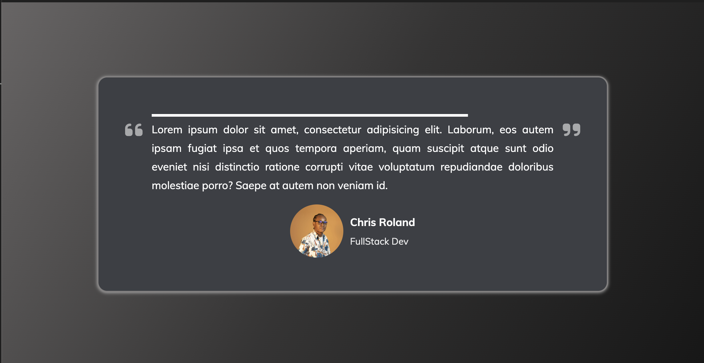

# Testimonial Component



A sleek and responsive testimonial slider built with HTML, CSS, and JavaScript. This component dynamically rotates through a collection of testimonials, showcasing user feedback with visually appealing animations. It's perfect for portfolios, landing pages, or websites that want to highlight client reviews.

## Key Features
- **Dynamic Testimonials**: Automatically rotates through a list of user testimonials every 10 seconds.
- **Progress Bar Animation**: A visual progress bar indicates the time remaining for each testimonial.
- **Responsive Design**: Fully optimized for different screen sizes, including mobile devices.
- **Interactive User Profile**: Displays user profile pictures, names, and roles alongside their testimonials.

## Technologies Used
- **Frontend**: HTML, CSS (with animations and transitions for a polished UI).
- **JavaScript**: Handles dynamic testimonial updates and timing.

## How to Run
1. Clone the repository:
   ```bash
   git clone https://github.com/yourusername/Testimonial-Component.git
   cd Testimonial-Component
   ```
2. Open `index.html` in your browser to view the component.

## Live Demo
Check out the live demo here: [Live Demo Link](https://chrisroland.github.io/Testimonial-Component/)

## Future Enhancements
- Add navigation buttons for manual control of testimonials.
- Implement a backend to fetch testimonials dynamically via API.
- Add multi-language support for global audiences.

## Contributions
- Feel free to **open issues** for any bugs or feature suggestions.
- **Pull requests** are welcome for adding new testimonials or enhancing the component.
- This project is **open-sourced**, and I appreciate **constructive feedback** and **collaborations**!

Thank you for exploring this project! ❤️